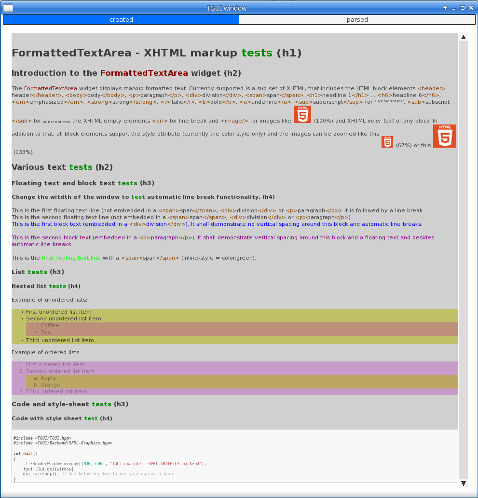

# TGUI-XHML
XHTML viewer widget for texus TGUI (see https://github.com/texus/TGUI/).

The sample aplication on Linux:

## Folders and files of the root folder
* include/TGUI                     - folder of include files
* src                              - folder of source files
* LICENSE                          - license text file
* README.md                        - this file
* TGUI-XHTML.cbp                   - **Code::Blocks** project file to compile a ***Linux*** dynamic link library
* TGUI-XHTML.depend                - **Code::Blocks** dependency file, auto generated by the compiler chain
* TGUI-XHTML.layout                - **Code::Blocks** personal preferences
* TGUI-XHTML.vcxproj               - **Visual Studio 2022** community edition project file to compile a ***Microsoft (R) Windows*** dynamic link library
* TGUI-XHTML.vcxproj.filters       - **Visual Studio 2022** community edition file filters
* TGUI-XHTML.vcxproj.user          - **Visual Studio 2022** community edition personal preferences
* XHTMLViewer-SampleAppProject.zip - archive of a test application (project files for **Code::Blocks** and **Visual Studio 2022** community edition included)
* dllmain.cpp                      - ***Microsoft (R) Windows*** dynamic link library entry point (not needed for ***Linux***)
