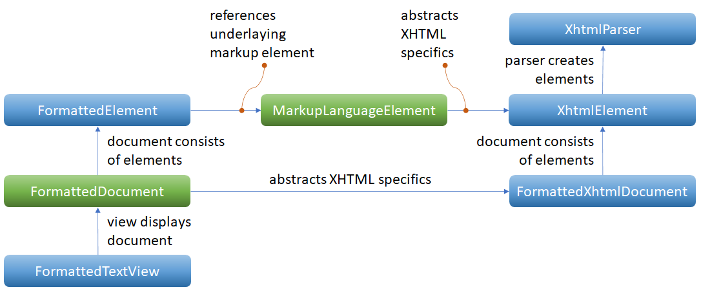

# TGUI-XHTML
A XHTML module with the main purpose to provide an XHTML viewer widget (or more beneral a ***rich text display widget***, but only XHTML formatting is currently impemented) for texus [TGUI](https://github.com/texus/TGUI/).

## Table of contents
* [First impression](#first-impression)
* [Introduction](#introduction)
* [Intention](#intention)
* [Limitations](#limitations)
* [Folders and files](#foldera-and-files)
* [Features](#features)
* [CSS styles](#css-styling)
* [Inline and CSS styling](#inline-styling)
* [Supported style attributes](#supported-style-attributes)
* [Supported tags](#supported-tags)
* [The TGUI-XHTML code](#extension-code)
* [The FormattedTextView widget](#formatted-text-widget)
* [The sample application](#sample-app)

# <a name="first-impression">First impression</a>
The next two images show the sample aplication on Linux
* image one: document created from DOM element C++ constructor calls (no XHTML parser involved) and
* image two: document parsed from HTML file (minmum of code required):

  

# <a name="introduction">Introduction</a>
This project is an extension for the [immediate mode GUI](https://en.wikipedia.org/wiki/Immediate_mode_GUI) TGUI. It includes the following main classes:



* The `XhtmlParser` parses an XHTML document and creates the DOM from **XhtmlElements**.
* One `XhtmlElement` holds one document object and all it's formatting and styling information.
* The `FormattedXhtmlDocument` represents the XHTML DOM and holds the `XhtmlElement`s in a tree.
* The `MarkupLanguageElement` is the base class of `XhtmlElement` and abstracts XHTML specifics.
* One `FormattedElement` provides the rendering information of one document object and holds a reference to the underlaying `MarkupLanguageElement`.
* The `FormattedTextDocument` represets the list of `FormattedElement` to display.
* The `FormattedTextView` widget displays the `FormattedTextDocument`.

These components are largely decoupled to allow easy further development as well as future support of alternative rich text formatting - e.g. markdown.

# <a name="intention">Intention</a>

This project does not claim to replace a browser plugin - the functionality available in a browser plugin is simply too powerful for that.<br/>
Rather, this project aims to provide a ***rich text display widget*** that is **easy** to integrate into an application. Where "easy" means: A seamless and painless integration into the already used GUI library. This also means: No loading of external components (browser plugin loading can take a lot of time), no glue-code, no external dependencies, no extra effort for deployment on the desired target system (Windows, Linux, ...) and no hassle with changing APIs.

There are several similar projects around, that address the same problem: An application/framework integrated rich text/XHTML document view without the hassle/complexity of a Browser PlugIn. Here are two samples:
* [XHTMLStatic](https://www.codeproject.com/Articles/2900/XHTMLStatic-An-Extra-Lean-Custom-Control-to-Displa) by Hans Dietrich 2002-2007 (C++, Windows)
* [GMarkupLabel](https://www.codeproject.com/Articles/31237/GMarkupLabel-A-C-Windows-Forms-control-to-display) by Georgi Atanasov, 2008 (C#, .NET)

Typical use cases for a ***rich text display widget*** include boosting static text displays (either in the application window or in a dialog - in both cases the response time is an important factor for the user experience) and an integrated help system (that should be able to browse through topics). I also recommend to read the *Introduction* of the article [XHTMLStatic](https://www.codeproject.com/Articles/2900/XHTMLStatic-An-Extra-Lean-Custom-Control-to-Displa) by Hans Dietrich - apart from his opinion on tables, I agree with him on all points.

# <a name="limitations">Limitations</a>
## HTML functionality
Since the focus of this module is the **simple** integration of a ***rich text display widget*** and not on the full-fledged replacement for a browser control, a choice has to be made about the functionality to be implemented.
Unfortunately, there is no clear line between something simple and compact on the one hand and something complex and excessive on the other - and so the choice of the functionality to be implemented is naturally subject to personal preferences and project requirements.

Not yet implemented but important functionalities (in my opinion) of a ***rich text display widget*** are:
* tables and
* links/anchors.

Tables aren't implemented at all yet, but planned.</br>
Links/anchors are implemented for document internal anchors yet. A navigation from document to document is planned.</br>
Also planned for the future is the possibility to select and copy.

Nevertheless, the functionality already available is so extensive that a description would be very laborious. Instead, I recommend studying the sample application - it tests all the currently available functionality and is an excellent source of knowledge.

## XHTML parser
This XHTML module includes a lightweight XHTML parser to make the module easy to use without external dependencies. This parser is heavily inspired by the great work [HTML Reader C++ Class Library](https://www.codeproject.com/Articles/6561/HTML-Reader-C-Class-Library), version dated 29 March 2004 and written by Gurmeet S. Kochar <gomzygotit@hotmail.com> aka [gUrM33T](https://www.codeproject.com/script/Membership/View.aspx?mid=547523).

Unfortunately, the original code is not cross-platform (uses MS Windows data types instead of STL data types) and has an customized infecting license. For these reasons, the lightweight XHTML parser included in this XHTML module is a complete re-implementation - with platform independence and robustness in mind.

Nevertheless, a visit to the original is worthwhile in any case.

In case the included lightweight XHTML parser is insufficient for a specific use case, I recommend to take a look at the [POCO C++ libraries](https://pocoproject.org/). These powerful cross-platform C++ libraries provide both a DOM and a SAX parser for XHTML (and many more).

# <a name="foldera-and-files">Folders and files</a>
* `include/TGUI/Xhtml        ` - folder of include files
* `src/Xhtml                 ` - folder of source files
* `sample-app                ` - folder of a test application (project files for **Code::Blocks** and **Visual Studio 2022** included)
* `LICENSE                   ` - license text file
* `README.md                 ` - this file
* `TGUI-XHTML.cbp            ` - **Code::Blocks** project file to compile a ***Linux*** dynamic link library
* `TGUI-XHTML.depend         ` - **Code::Blocks** dependency file, auto generated by the compiler chain
* `TGUI-XHTML.layout         ` - **Code::Blocks** personal preferences
* `TGUI-XHTML.vcxproj        ` - **Visual Studio 2022** project file for a ***Microsoft (R) Windows*** dynamic link library
* `TGUI-XHTML.vcxproj.filters` - **Visual Studio 2022** file filters
* `TGUI-XHTML.vcxproj.user   ` - **Visual Studio 2022** personal preferences
* `XhtmlViewer_01.png        ` - Image of sample application, with a document created from DOM element C++ constructor calls
* `XhtmlViewer_02.png        ` - Image of sample application, with a document parsed from HTML file
* `XhtmlViewer_Classes.png   ` - Image of class ctructure
* `dllmain.cpp               ` - ***Microsoft (R) Windows*** dynamic link library entry point (not needed for ***Linux***)

# <a name="features">Features</a>
List of supported XHTML features
* [CSS styles](#css-styling)
* [Inline and CSS styling](#inline-styling)
* [Supported style attributes](#supported-style-attributes)
* [Supported tags](#supported-tags)

# <a name="css-styling">CSS styling</a>
CSS styles are always to be registered to the `<head>` [tag](#supported-tags). Currently supported are:
* ***element type*** selectors (like `<h1>`, `<div>` or `<pre>`),
* ***class*** selectors (like `.centered`, `.colored` or `.highlight`) and
* the combination of ***element type*** and ***class*** selector (like `h1.centered`, `div.colored` or `pre.highlight`).

To apply a CSS style, the respective element must have a CSS registered for it's ***element type***, have a ***class*** attribute and a CSS registered for it's ***class*** or have a ***class*** attribute and a CSS registered for the combination of it's ***element type*** and ***class*** selector.

If multiple CSS styles are applicable, all styles are applied but the most specific ones are applied last. The sequende is: ***element type*** based styles first, ***class*** based styles next and the combination of ***element type*** and ***class*** bases styles last. Thus, later applied styles can (partially) override earlier applied styles.

## CSS styles - to be created from DOM element C++ constructor calls
```
auto htmlHead  = tgui::XhtmlElement::createHead(htmlRoot);
auto thmlStyle = tgui::XhtmlElement::createStyle(htmlHead);
thmlStyle->setEntry(U"cp", std::make_shared<tgui::XhtmlStyleEntry>(tgui::Color(U"#666666"), U"Monospace",
                    tgui::OneDimSize(tgui::SizeType::Relative, 1.0f),
                    static_cast<tgui::TextStyle>(tgui::TextStyle::Italic  | tgui::TextStyle::Bold)));
thmlStyle->setEntry(U"kt", std::make_shared<tgui::XhtmlStyleEntry>(tgui::Color(U"#666666"), U"Monospace",
                    tgui::OneDimSize(tgui::SizeType::Relative, 1.0f),
                    static_cast<tgui::TextStyle>(tgui::TextStyle::Regular | tgui::TextStyle::Bold)));
...
```


## CSS styles - to be parsed from HTML file
```
<html>
    <head>
        <style>
             pre.highlight {background-color: #f0f0f0; border-color: #a0a0a0; border-width: 1px; padding: 0px 4px;}
             span.cp {color: #666666; font-style: italic; font-weight: bold;}
            ...
        </style>
    </head>
</html>
```

# <a name="inline-styling">Inline styling</a>
If there are applicable CSS styles, they are applid before the inline styles. Thus, an inline style can (partially) override CSS styles.

## Inline style - to be created from DOM element C++ constructor calls
***auto*** **span1** = *tgui::XhtmlElement::createSpan*(***nullptr***, *tgui::Color*(U"#008800"),<br/>
&nbsp; &nbsp; &nbsp; &nbsp; &nbsp; &nbsp; &nbsp; &nbsp; &nbsp; &nbsp; &nbsp; &nbsp; &nbsp; &nbsp; &nbsp; &nbsp; &nbsp; &nbsp; &nbsp; &nbsp; &nbsp; &nbsp; &nbsp; &nbsp; &nbsp; &nbsp; &nbsp; &nbsp; &nbsp; &nbsp; &nbsp; &nbsp; &nbsp; &nbsp; &nbsp; &nbsp; &nbsp; &nbsp; &nbsp; &nbsp; &nbsp; &nbsp; &nbsp; &nbsp; &nbsp; &nbsp; &nbsp; *tgui::XhtmlElement::createInnerText*(***nullptr***, U"test local color"));<br/>
***auto*** **silverBG** = ***std::make_shared***<*tgui::XhtmlStyleEntry>*();<br/>
**silverBG**->*setBackgroundColor*(*tgui::Color*(248, 248, 248, 255));<br/>
**silverBG**->*setBorderColor*(*tgui::Color*(160, 160, 160, 192));<br/>
**silverBG**->*setBorderWidth*(*tgui::FourDimSize*(*tgui::SizeType::Pixel*, 1.0f));<br/>
**silverBG**->*setPadding*(*tgui::FourDimSize*(*tgui::SizeType::Pixel*, 0.0f, 4.0f));<br/>
***auto*** **div1** = *tgui::XhtmlElement::createDivision*(***nullptr***, **silverBG**, *tgui::XhtmlElement::createInnerText*(***nullptr***, U"test style"));
        
## Inline style - to be parsed from HTML file
***&lt;span*** **style**="color:green"&gt; test inline color ***&lt;/span&gt;***<br/>
***&lt;style&gt;***<br/>
&nbsp; &nbsp; **silverBG** {***background-color***:#f0f0f0; ***border-color***:#a0a0a0; ***border-width***:1px; ***padding***:0px 4px;}<br/>
***&lt;/style&gt;***<br/>
***&lt;div*** **class**="silverBG"&gt; test style ***&lt;/div&gt;***<br/>

# <a name="supported-style-attributes">Supported style attributes</a>
* background-color<sup>[1]</sup>
* border-color<sup>[1]</sup>
* color<sup>[1]</sup>
* opacity<sup>[2]</sup>
* border-width<sup>[356]</sup>
* padding<sup>[456]</sup>
* margin<sup>[456]</sup>
* font-style<sup>[7]</sup>
* font-weight<sup>[8]</sup>

<sup>[1]</sup> supported are all 142 web [color names](https://www.w3schools.com/colors/colors_names.asp) and values with *#RRGGBB* syntax<br/>
<sup>[2]</sup> values between *0.0* = full transparency and *1.0* = full opacity<br/>
<sup>[3]</sup> supported are the alias names *thin* translated to 1px, *medium* translated to 3px and *thick* translated to 5px as well as 1...4 numeric values, optionally with prefix for the measuring unit<br/>
<sup>[4]</sup> supported are 1...4 numeric values, optionally with prefix for the measuring unit<br/>
<sup>[5]</sup> if one numeric value is provided, it is applied to top, right, bottom and left<br/>
&nbsp; &nbsp;if two numeric values are provided, they are applied to top/bottom and right/left<br/>
&nbsp; &nbsp;if three numeric values are provided, they are applied to top, right/left and bottom<br/>
&nbsp; &nbsp;if four numeric values are provided, they are applied to top, right, bottom and left<br/>
<sup>[6]</sup> the default measuring unit is pixels, the measuring unit can be defined expilcitly with the appendices *px* for pixels, *pt* for points, *em* for equivalemt of 'M' and *%*, but the behavior of *%* is currently unpredictable<br/>
<sup>[7]</sup> supported are *regular* and *italic*<br/>
<sup>[8]</sup> supported are *regular* and *bold*

# <a name="supported-tags">Supported tags</a>
* `<!doctype>` (in that way, that it doesn't create errors or warnings)
* `<document>` (in that way, that it doesn't create errors or warnings)
* `<html>`<sup>[1]</sup> (ready to contain `<head>` and `<body>`)
* `<head>` (ready to contain `<meta>`, `<title>` and `<style>`)
* `<meta>` (in that way, that it doesn't create errors or warnings)
* `<title>` (in that way, that it doesn't create errors or warnings)
* `<style>` (see [CSS styles](#css-styling))
* `<body>`<sup>[1]</sup> (ready to contain all the tags below)
* `<h1>`<sup>[1]</sup> ... `<h6>`<sup>[1]</sup> for head line 1st order ... 6th order
* `<em>` for emphasized and `<i>` for italic
* `<s>` for strong `<b>` for bold
* `<u>` for underline
* `<sup>` for superscript and `<sub>` for subscript
* `<ul>`<sup>[1]</sup> for unordered list, `<ol>`<sup>[1]</sup> for ordered list and `<li>`<sup>[1]</sup> for list item
* `<span>`<sup>[1]</sup>, `<div>`<sup>[1]</sup> for division and `<p>`<sup>[1]</sup> for paragraph
* `<pre>`<sup>[1]</sup> for preformatted and `<code>`<sup>[1]</sup> for code
* `<br/>` for line break
* `` for image

<sup>[1]</sup> can be styled with [inline and CSS styling](#inline-styling)

# <a name="extension-code">The TGUI-XHTML code</a>
The XHTML viewer widget has been developed and tested on these environments:
* Manjaro Linux (22.0) x64, Code::Blocks 20.03, gnu compiler collection 12.2.1-1
* Windows 11 x64, Visual Studio 2022 community edition

The code is ready to be compiled as a separate dynamic link library or to be integrated (either into a custom TGUI build or into the target application).<br/>
Since a DLL on Windows forces the programmer to distinguish between imported and exported API (which Linux does not), a little trick has to be used for Windows, which can be found in every CPP file:

// MSC needs a clear distiction between `__declspec(dllimport)` (above) and `__declspec(dllexport)` (below) this comment.
// So in the case of direct source file integration (in contrast to library creation and linking), the API must be 'dllexport'.
```
#ifndef TGUI_STATIC
#ifdef TGUI_SYSTEM_WINDOWS
#undef TGUI_API
#define TGUI_API __declspec(dllexport)
#endif
#endif
```

# <a name="formatted-text-widget">The FormattedTextView widget</a>
The widget displays static (not editable) formatted text. The widget suppors scroll bars in both directions. By default the policy of the vertical scrollbar is initialized to ***always*** and the visibility is set to ***true*** while the policy of the horizontal scroll bar is set to ***automatic*** and the visibility is set to ***false***.

The widget also supports zoom between 10% and 1000%. To zoom, the scroll wheel hast to be crolled with pressed control key.

# <a name="sample-app">The sample application</a>
The sample application has (like the XHTML viewer widget) been developed and tested on these environments:
* Manjaro Linux (22.0) x64, Code::Blocks 20.03, gnu compiler collection 12.2.1-1
* Windows 11 x64, Visual Studio 2022 community edition

The sample application is based on a TGUI build for the **SFML_GRAPHICS** backend. It tests all the currently available functionality and therefore has sample code for all the currently available functionality.<br/>
The sample application contains a `TabContainer` widget with two tabs: The first tab contains a `FormattedTextView` (XHTML viewer) widget, that displays the content of a `FormattedTextXhtmlDocument` (rich text) document created from DOM element C++ constructor calls. The second tab contains another `FormattedTextView` (XHTML viewer) widget, that displays the content of another `FormattedTextXhtmlDocument` (rich text) document created from parsing an HTML file.
